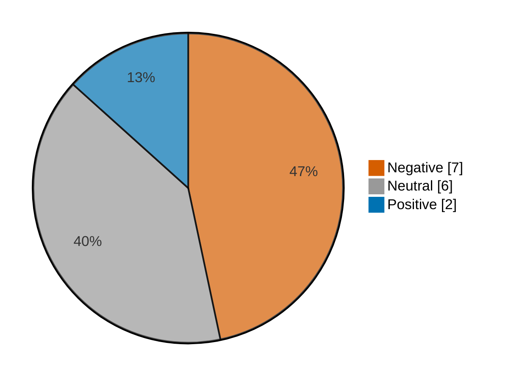

# Newsmood — 2026-10-02

**Mood index: -26.4** (moderately negative) · 15 headlines from 2 sources · model unsure on 2

## Mood at a glance

Negative 7 (46.7%) · Positive 2 (13.3%) · Neutral 6 (40.0%)

## What happened

_Offline report: no written summary. Every number on this page is computed from the model's labels._

## Recommended articles (highest model certainty, not most important)

### Negative

- [Traders now see little chance of a Fed rate hike in October after weak jobs report](<https://www.cnbc.com/2026/10/02/fed-rate-hike-odds-decline-after-september-jobs-report.html>) · 94% · cnbc-finance
- [Why Western Digital and Seagate are seeing big stock drops today](<https://www.marketwatch.com/story/why-western-digital-and-seagate-are-seeing-big-stock-drops-today-6b16d95e?mod=mw_rss_topstories>) · 92% · marketwatch-top
- [This city saw 1 in 3 home sellers slash their asking price in September to attract reluctant buyers](<https://www.marketwatch.com/story/this-city-saw-1-in-3-home-sellers-slash-their-asking-price-in-september-to-attract-reluctant-buyers-7f16a0c3?mod=mw_rss_topstories>) · 86% · marketwatch-top

### Positive

- [How AI is redefining Wall Street jobs — and boosting demand for this new 'hottest skill' by 1,721%](<https://www.cnbc.com/2026/10/02/ai-redefining-wall-street-jobs.html>) · 97% · cnbc-finance
- ['The hottest skill on Wall Street’: Demand for this AI ability jumped 1,721% as banks embrace agents](<https://www.cnbc.com/2026/10/02/ai-skills-most-in-demand-at-jpmorgan-chase-citigroup-capital-one.html>) · 96% · cnbc-finance

_Only 2 positive headlines today._

### Neutral

- [My wife never went back to work after raising our kids. Do I have to share my retirement savings 50/50?](<https://www.marketwatch.com/story/my-wife-never-went-back-to-work-after-raising-our-kids-do-i-have-to-share-my-retirement-savings-50-50-f0727f82?mod=mw_rss_topstories>) · 98% · marketwatch-top
- [I’m 71 and still working. I earn $108,000 a year. Am I doing the right thing?](<https://www.marketwatch.com/story/im-71-and-still-working-i-earn-108-000-a-year-am-i-doing-the-right-thing-aaedcaa4?mod=mw_rss_topstories>) · 97% · marketwatch-top

## Sources

| Source | Headlines | Negative | Neutral | Positive |
|---|--:|--:|--:|--:|
| marketwatch-top | 11 | 5 | 6 | 0 |
| cnbc-finance | 4 | 2 | 0 | 2 |

All 15 headlines

| Sentiment | Certainty | Headline | Source |
|---|--:|---|---|
| negative | 94% | [Traders now see little chance of a Fed rate hike in October after weak jobs report](<https://www.cnbc.com/2026/10/02/fed-rate-hike-odds-decline-after-september-jobs-report.html>) | cnbc-finance |
| negative | 92% | [Why Western Digital and Seagate are seeing big stock drops today](<https://www.marketwatch.com/story/why-western-digital-and-seagate-are-seeing-big-stock-drops-today-6b16d95e?mod=mw_rss_topstories>) | marketwatch-top |
| negative | 86% | [This city saw 1 in 3 home sellers slash their asking price in September to attract reluctant buyers](<https://www.marketwatch.com/story/this-city-saw-1-in-3-home-sellers-slash-their-asking-price-in-september-to-attract-reluctant-buyers-7f16a0c3?mod=mw_rss_topstories>) | marketwatch-top |
| negative | 83% | [Falling wages, soaring energy prices and inflation: It’s beginning to look a lot like the 1970s](<https://www.marketwatch.com/story/falling-wages-soaring-energy-prices-and-inflation-its-beginning-to-look-a-lot-like-the-1970s-d645cbca?mod=mw_rss_topstories>) | marketwatch-top |
| negative | 75% | [Bitget 'not expecting to recover a lot' from $388 million hack, CEO tells CNBC](<https://www.cnbc.com/2026/10/02/bitget-crypto-stolen-hack-recovery.html>) | cnbc-finance |
| negative | 58% (unsure) | [Europe’s leaders rush to release diesel from stockpiles as fuel shock hangs over U.S. midterms](<https://www.marketwatch.com/story/europes-leaders-rush-to-release-diesel-from-stockpiles-as-fuel-shock-hangs-over-u-s-midterms-80bf0f38?mod=mw_rss_topstories>) | marketwatch-top |
| negative | 39% (unsure) | [Tesla sold a lot more EVs than Wall Street expected, and the stock is surging](<https://www.marketwatch.com/story/tesla-ev-sales-beat-wall-streets-expectations-again-and-the-stock-jumps-294a4f53?mod=mw_rss_topstories>) | marketwatch-top |
| positive | 97% | [How AI is redefining Wall Street jobs — and boosting demand for this new 'hottest skill' by 1,721%](<https://www.cnbc.com/2026/10/02/ai-redefining-wall-street-jobs.html>) | cnbc-finance |
| positive | 96% | ['The hottest skill on Wall Street’: Demand for this AI ability jumped 1,721% as banks embrace agents](<https://www.cnbc.com/2026/10/02/ai-skills-most-in-demand-at-jpmorgan-chase-citigroup-capital-one.html>) | cnbc-finance |
| neutral | 98% | [My wife never went back to work after raising our kids. Do I have to share my retirement savings 50/50?](<https://www.marketwatch.com/story/my-wife-never-went-back-to-work-after-raising-our-kids-do-i-have-to-share-my-retirement-savings-50-50-f0727f82?mod=mw_rss_topstories>) | marketwatch-top |
| neutral | 97% | [I’m 71 and still working. I earn $108,000 a year. Am I doing the right thing?](<https://www.marketwatch.com/story/im-71-and-still-working-i-earn-108-000-a-year-am-i-doing-the-right-thing-aaedcaa4?mod=mw_rss_topstories>) | marketwatch-top |
| neutral | 97% | [‘I don’t want to die on the sales floor’: I’m 67 and earn $19.50 an hour at a big-box store. When can I finally retire?](<https://www.marketwatch.com/story/i-dont-want-to-die-on-the-sales-floor-im-67-and-earn-19-50-an-hour-at-a-big-box-store-when-can-i-finally-retire-369abcf9?mod=mw_rss_topstories>) | marketwatch-top |
| neutral | 96% | [Saving your retirement could come down to this simple writing exercise](<https://www.marketwatch.com/story/saving-your-retirement-could-come-down-to-this-simple-writing-exercise-c25734a9?mod=mw_rss_topstories>) | marketwatch-top |
| neutral | 90% | [Does AI have a soul? Pope Leo and Anthropic clash.](<https://www.marketwatch.com/story/does-ai-have-a-soul-pope-leo-and-anthropic-clash-0c1669fb?mod=mw_rss_topstories>) | marketwatch-top |
| neutral | 70% | [Why mixing politics with your stock portfolio might be costing you money](<https://www.marketwatch.com/story/why-mixing-politics-with-your-stock-portfolio-might-be-costing-you-money-5b4aabfb?mod=mw_rss_topstories>) | marketwatch-top |

---

Certainty is the model's confidence in its label; below 60% it is marked unsure.

Links go to the original publisher; some limit free articles.

Model: kkrit-tinna/newsmood-distilbert-financial@be7b809e0d8f7bd50e77d902aee199363b7e2a66 · Gates: not yet implemented · Not financial advice.
