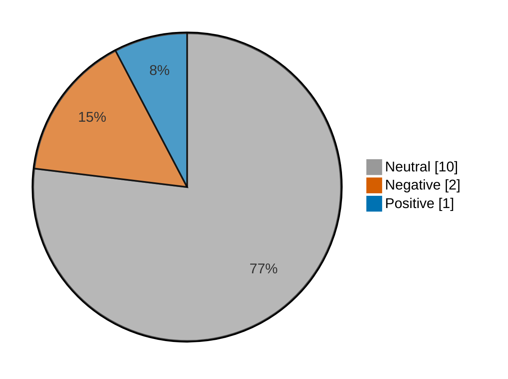

# Newsmood — 2026-10-07

**Mood index: -9.4** (mildly negative) · 13 headlines from 2 sources · model unsure on 1

## Mood at a glance

Negative 2 (15.4%) · Positive 1 (7.7%) · Neutral 10 (76.9%)

## What happened

Financial news leaned mildly negative today (index -9.4, up 17.0 from Fri Oct 2) over 13 headlines, with no single theme in the lead.

**Clusters:** no clear theme today.

_Themes use TF-IDF fit on 148 headlines (2026-09-12–2026-10-07)._

## Recommended articles (highest model certainty, not most important)

### Negative

- [Options traders are betting on a dramatic drop in interest rates](<https://www.marketwatch.com/story/options-traders-are-betting-on-a-dramatic-drop-in-interest-rates-141066fb?mod=mw_rss_topstories>) · 96% · 34.9% of the day's movement · marketwatch-top
- [Rising yields are quietly crashing the stock market’s earlier winners of 2026](<https://www.marketwatch.com/story/rising-yields-are-quietly-crashing-the-stock-markets-earlier-winners-of-2026-a29f2863?mod=mw_rss_topstories>) · 93% · 33.8% of the day's movement · marketwatch-top

_Only 2 negative headlines today._

### Positive

- [Higher yields are taking their toll on all areas of the stock market, except the one that matters](<https://www.marketwatch.com/story/higher-yields-are-taking-their-toll-on-all-areas-of-the-stock-market-except-the-one-that-matters-69a90322?mod=mw_rss_topstories>) · 86% · 31.4% of the day's movement · marketwatch-top

_Only 1 positive headline today._

### Neutral

- [Stocks are increasingly their own best hedge. This chart shows why.](<https://www.marketwatch.com/story/stocks-are-increasingly-their-own-best-hedge-this-chart-shows-why-19a79b68?mod=mw_rss_topstories>) · 98% · marketwatch-top
- [My brother-in-law convinced his parents to sign over their home and life savings to buy a $3 million compound. Do I intervene?](<https://www.marketwatch.com/story/my-brother-in-law-convinced-his-parents-to-sign-over-their-home-and-savings-to-buy-a-3-million-compound-do-i-intervene-03fb96b7?mod=mw_rss_topstories>) · 97% · marketwatch-top

## Sources

| Source | Headlines | Negative | Neutral | Positive |
|---|--:|--:|--:|--:|
| marketwatch-top | 11 | 2 | 8 | 1 |
| cnbc-finance | 2 | 0 | 2 | 0 |

All 13 headlines

| Sentiment | Certainty | Headline | Source |
|---|--:|---|---|
| negative | 96% | [Options traders are betting on a dramatic drop in interest rates](<https://www.marketwatch.com/story/options-traders-are-betting-on-a-dramatic-drop-in-interest-rates-141066fb?mod=mw_rss_topstories>) | marketwatch-top |
| negative | 93% | [Rising yields are quietly crashing the stock market’s earlier winners of 2026](<https://www.marketwatch.com/story/rising-yields-are-quietly-crashing-the-stock-markets-earlier-winners-of-2026-a29f2863?mod=mw_rss_topstories>) | marketwatch-top |
| positive | 86% | [Higher yields are taking their toll on all areas of the stock market, except the one that matters](<https://www.marketwatch.com/story/higher-yields-are-taking-their-toll-on-all-areas-of-the-stock-market-except-the-one-that-matters-69a90322?mod=mw_rss_topstories>) | marketwatch-top |
| neutral | 98% | [Stocks are increasingly their own best hedge. This chart shows why.](<https://www.marketwatch.com/story/stocks-are-increasingly-their-own-best-hedge-this-chart-shows-why-19a79b68?mod=mw_rss_topstories>) | marketwatch-top |
| neutral | 97% | [My brother-in-law convinced his parents to sign over their home and life savings to buy a $3 million compound. Do I intervene?](<https://www.marketwatch.com/story/my-brother-in-law-convinced-his-parents-to-sign-over-their-home-and-savings-to-buy-a-3-million-compound-do-i-intervene-03fb96b7?mod=mw_rss_topstories>) | marketwatch-top |
| neutral | 97% | [Fed officials see another hike coming, but no sign as to when, minutes show](<https://www.cnbc.com/2026/10/07/fed-officials-see-another-hike-coming-but-no-sign-as-to-when-minutes-show.html>) | cnbc-finance |
| neutral | 95% | [‘He grew up wealthy’: My husband inherited $3 million. He wants a vacation home. I want to save for retirement. Who’s right?](<https://www.marketwatch.com/story/he-grew-up-wealthy-my-husband-inherited-3-million-he-wants-a-vacation-home-i-want-to-save-for-retirement-a240f0d8?mod=mw_rss_topstories>) | marketwatch-top |
| neutral | 92% | [Washington and Wall Street chose to delay paying their bills — and to put them on your tab](<https://www.marketwatch.com/story/washington-and-wall-street-chose-to-delay-paying-their-bills-and-to-put-them-on-your-tab-2eba83aa?mod=mw_rss_topstories>) | marketwatch-top |
| neutral | 85% | [Fed’s minutes show no appetite for a series of interest-rate hikes](<https://www.marketwatch.com/story/fed-minutes-show-no-appetite-for-a-series-of-interest-rate-hikes-8b1c6436?mod=mw_rss_topstories>) | marketwatch-top |
| neutral | 70% | [The ‘Magnificent Seven’ are now big enough to move the economy. Why that could be a problem.](<https://www.marketwatch.com/story/the-magnificent-seven-are-now-big-enough-to-move-the-economy-why-that-could-be-a-problem-56d174db?mod=mw_rss_topstories>) | marketwatch-top |
| neutral | 69% | [Microsoft and Nvidia are teaming up on a supercharged AI laptop](<https://www.marketwatch.com/story/microsoft-and-nvidia-are-teaming-up-on-a-supercharged-ai-laptop-f58b28d8?mod=mw_rss_topstories>) | marketwatch-top |
| neutral | 62% | [Why AI is both the hope and the hazard for world leaders, according to IMF chief Georgieva](<https://www.cnbc.com/2026/10/07/economy-inflation-ai-trade-imf-iran-hormuz-trump-.html>) | cnbc-finance |
| neutral | 48% (unsure) | [SpaceX may chase ‘stunning’ AI returns by taking on a lot of debt to buy Nvidia chips](<https://www.marketwatch.com/story/spacex-reportedly-is-looking-to-raise-as-much-money-as-the-company-generates-in-revenue-to-buy-nvidia-chips-01ca6d82?mod=mw_rss_topstories>) | marketwatch-top |

---

Certainty is the model's confidence in its label; below 60% it is marked unsure.

"Of the day's movement" is a headline's certainty over the sum of every non-neutral headline's certainty: its part in moving the index. Neutral headlines move it by 0.

Links go to the original publisher; some limit free articles.

Model: kkrit-tinna/newsmood-distilbert-financial@be7b809e0d8f7bd50e77d902aee199363b7e2a66 · Gates: not yet implemented · Not financial advice.
